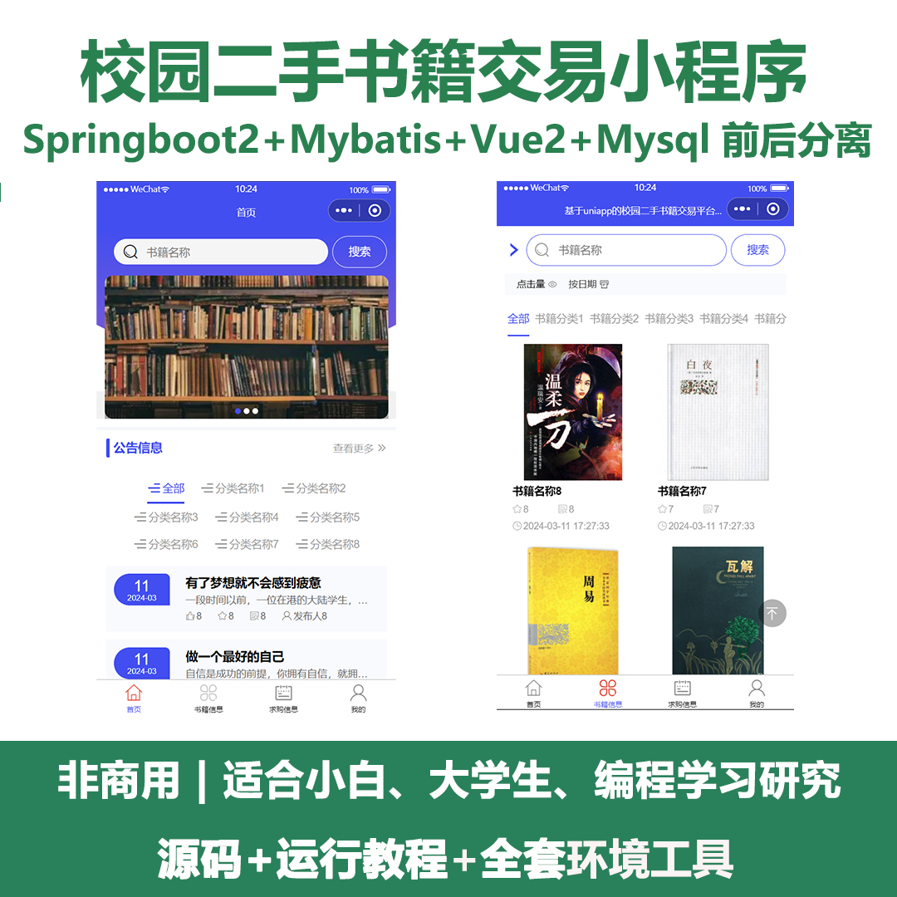
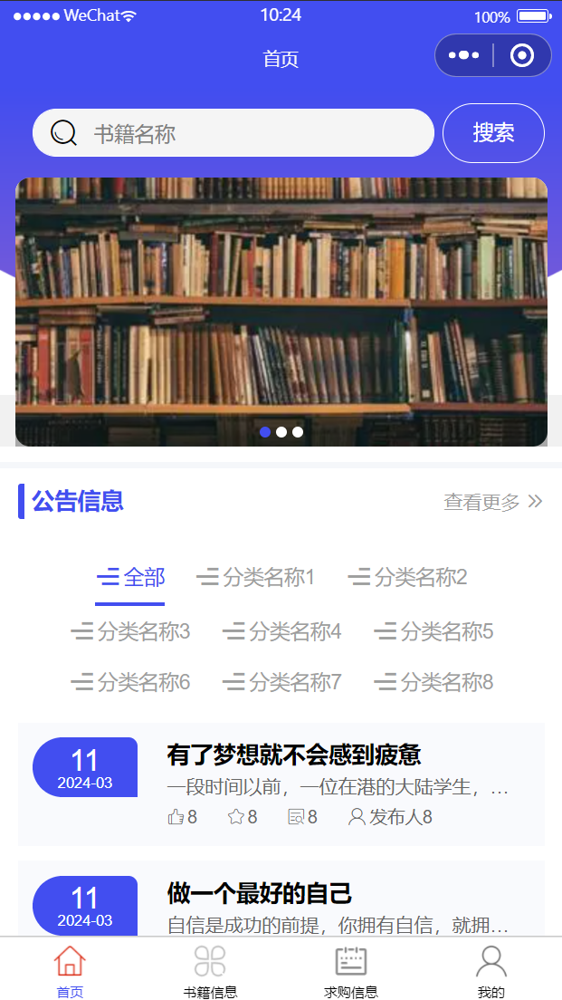
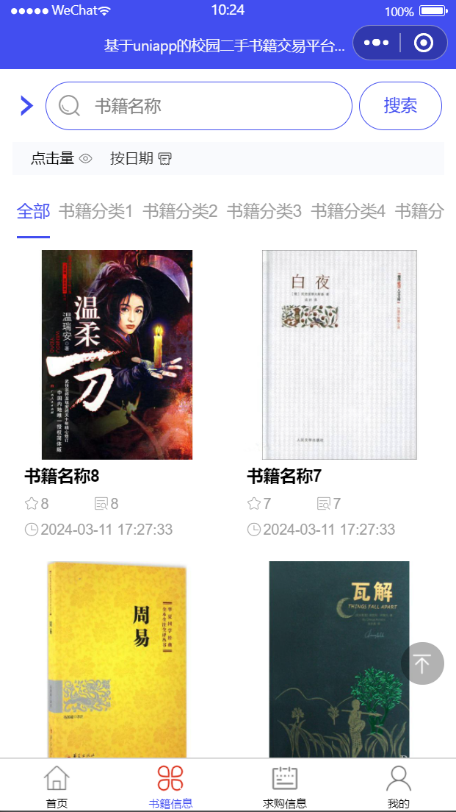
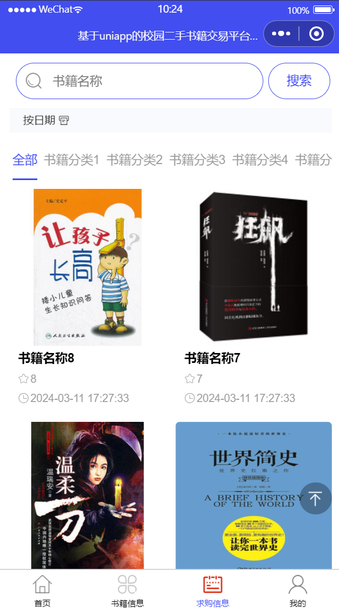
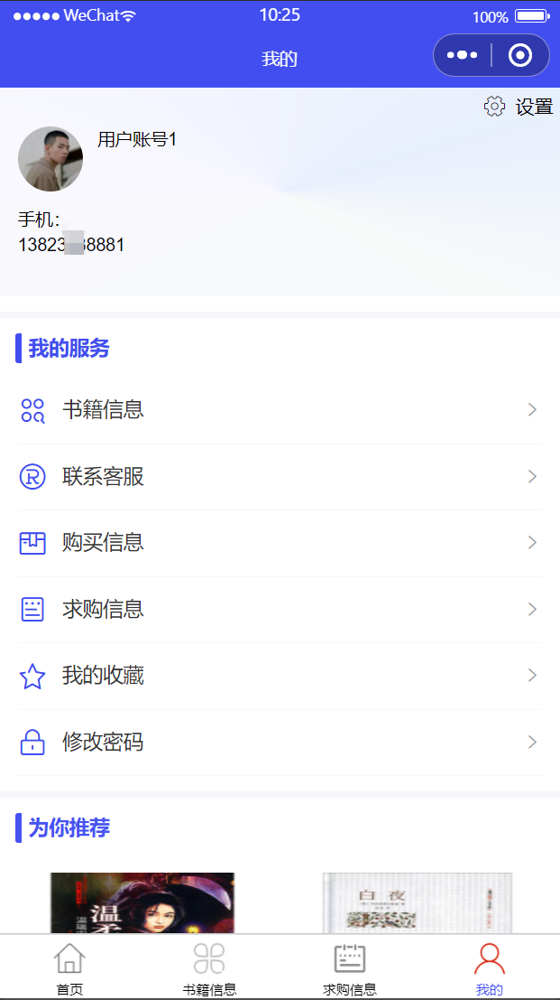
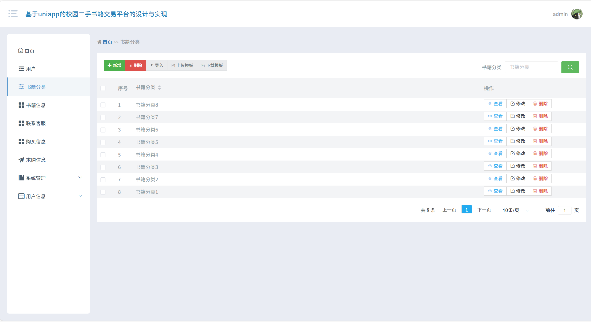
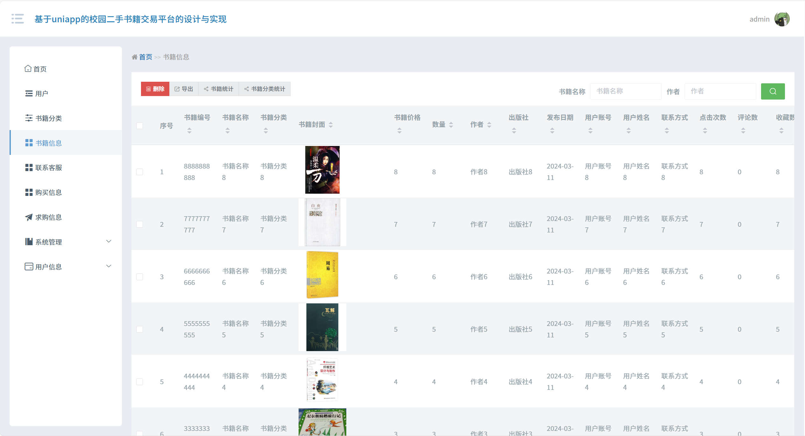
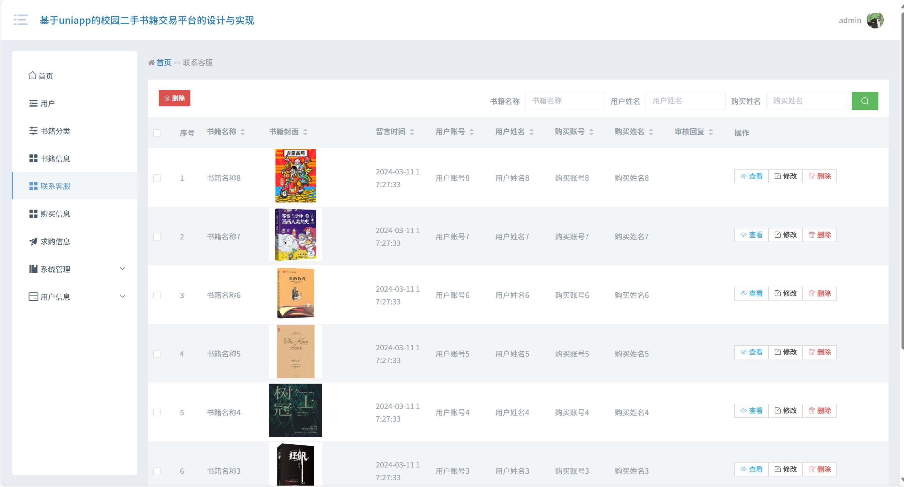
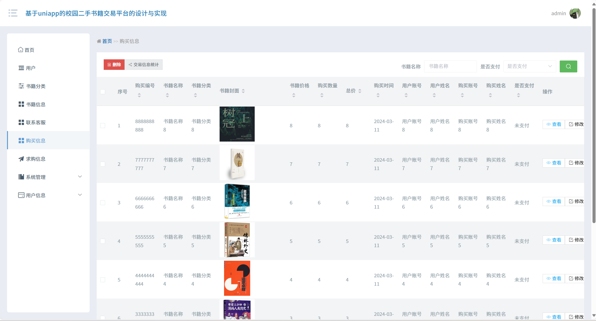

# mpweixinA093
mpweixinA093校园二手书籍交易微信小程序
 
## 查看主页获取源码

### 一、关键词
校园二手书交易小程序，校园二手书籍买卖小程序，校园闲置书籍交易小程序

### 二、作品包含
源码+数据库+全套环境和工具资源+本地部署教程

### 三、项目技术
前端技术： Html、Css、Js、Vue2.0、Element-ui、uniapp
后端技术：Java、SpringBoot2.0、MyBatis

### 四、运行环境（以下版本亲测，其他版本兼容性请自行测试）
开发工具：IDEA/eclipse  + VSCODE + 微信开发者工具 + HBuilder X

数据库：MySQL5.7（最低要5.7版本）

数据库管理工具：Navicat10以上版本

环境配置软件： JDK1.8 + Maven3.6.3

前端Nodejs：14

浏览器：谷歌浏览器

### 五、项目介绍
项目编号：mpweixinA093

校园二手书籍交易微信小程序可帮助校园师生便捷发布、浏览、购买或出售二手书籍，实现闲置书籍资源高效流转与复用，降低购书成本并减少资源浪费。
首页：展示公告信息、书籍相关内容等，方便用户快速获取平台动态与书籍概览。
书籍信息：提供书籍分类展示、搜索等功能，助力用户查找心仪二手书籍。
求购信息：展示用户求购书籍的相关需求，便于有对应书籍的用户进行交易对接。
个人中心：可查看用户账号、手机等信息，还能进行书籍信息管理、联系客服、查看购买与求购信息、管理收藏以及修改密码等操作。
后台管理（书籍分类）：支持书籍分类的新增、删除、导入、修改等操作，对书籍分类进行高效管理。
后台管理（书籍信息）：可对书籍编号、名称、分类、价格等详细信息进行删除、导出等管理操作，还能进行书籍统计与分类统计。
后台管理（联系客服）：管理用户与客服的交互信息，包括留言时间、审核回复等，支持查看、修改、删除等操作。
后台管理（购买信息）：对购买编号、书籍名称、价格、购买时间等购买相关信息进行管理，可删除数据、统计交易信息。
   

### 六、运行截图

